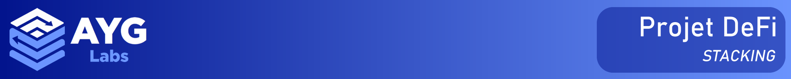
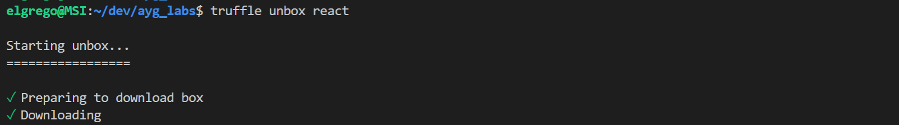
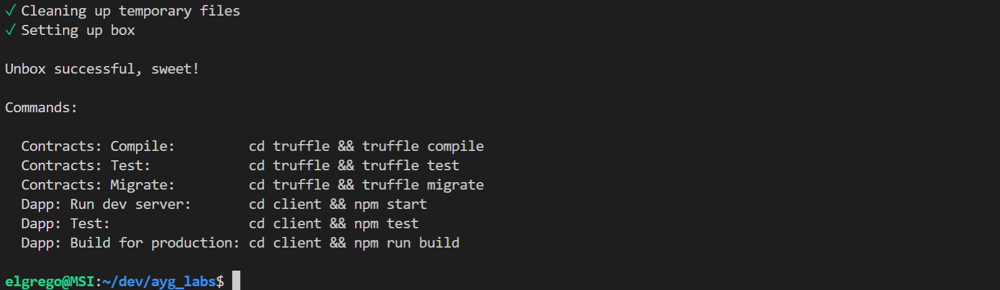
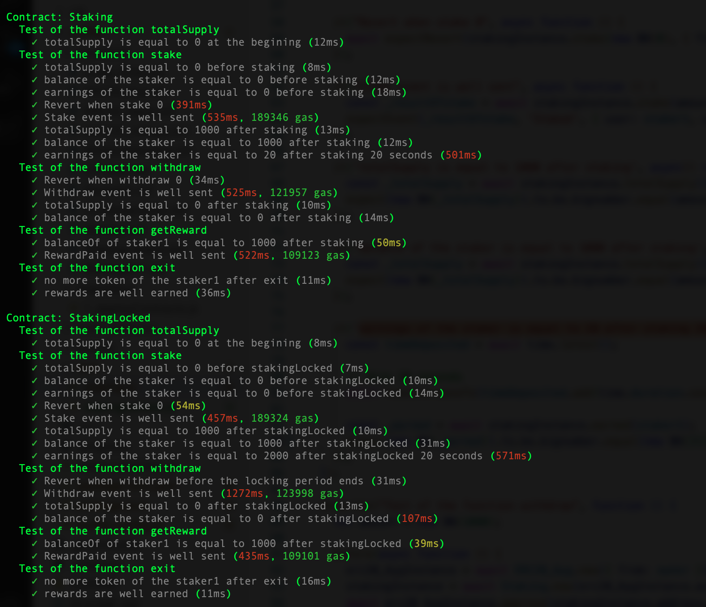
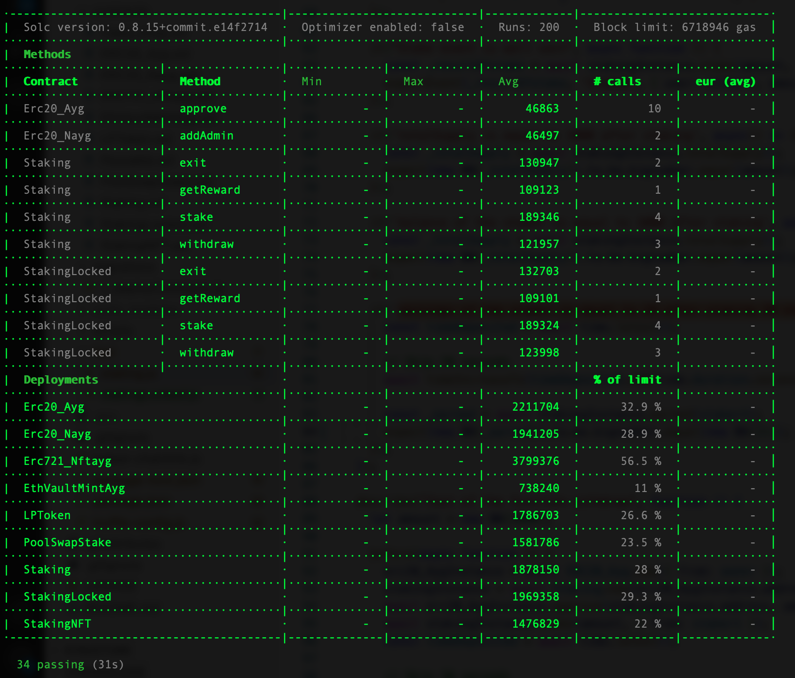
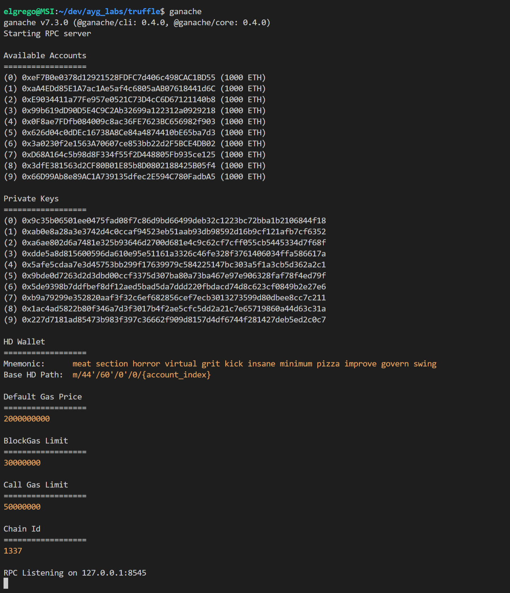
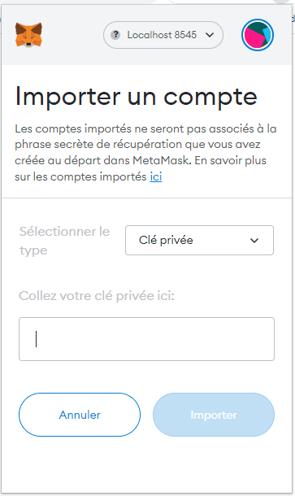

Ce projet DeFi consiste à mettre en place une solution de stacking ERC20 utilisant une méthode de récompense proportionnelle au montant stacké.
Le staking principal se fait sur le token du protocol AYG qui permet de générer du token AYG. Nous avons en plus introduit un staking de LP token lorsque l'utilisateur fournit de la liquidité dans la pool maison du protocol. Il permet également d'être récompensé avec des tokens AYG. Enfin, l'utilisateur peut minter des NFT pour obtenir des bonus de staking en étant récompensé par des tokens spécifique les nAYG. Ceux-ci constituent avec le token principal, le AYG, une pool qui permet de swap entre eux ces deux tokens. générant ainsi des trading fees et staking rewards pour ces derniers. 
Le protocol permet également d'obtenir des tokens AYG en fournissant en collatéral de l'ETH dans un VAULT. Grâce à Chainlink, nous avons défini que ces derniers, peuvent minter la moitié de la valeur d'un ETH en token AYG, soit un collatéral de 200%.
Nous avons également rajouté en bonus le widget d'Uniswap qui lorsque nous aurons déployé la dapp sur le tesnet Kovan, permettra de réaliser des swap entre l'ETH et le AYG.

__Auteurs :__
- Alex YE
- Yannick JEN
- Gregory BADET

<br />
<br />
<br />
<br />
<br />


# Spécifications fonctionnelles
- Pouvoir 'stake' son token ERC20
- Pouvoir 'unstake' ses tokens
- Créer son propre token de récompense ou utiliser l’ETH ou un autre token ERC20 
- Respecter un ratio entre la quantité de la récompense et la valeur bloquées sur le smart contract
- Utiliser l’oracle Chainlink
- Stake un token ERC20 avec vérouillage pendant un temps donnée pour obtenir des récompenses supplémentaires
- Calculer l'APR
- Connexion à Chainlink pour récupérer les pairs de valeurs
- Fonction de vault
- Swap de notre token AYG avec du nAYG
- Récompense par NFT

<br />
<br />
<br />

1. Présentation de la Dapp du projet staking


2. Présentation du contrat de staking

https://youtu.be/3WialhsSXkU


3. Vidéo du POOL, du staking du LP, du SWAP et du VAULT

https://www.loom.com/share/3279657767cd42c79f790880d00a74ba


# Table des matières  
- [Spécifications fonctionnelles](#spécifications-fonctionnelles)
- [Table des matières](#table-des-matières)
- [1. DOSSIER DE TRAVAIL](#1-dossier-de-travail)
  - [1.1.Installation des PACKAGES](#11installation-des-packages)
    - [1.1.1 TRUFFLE-UNBOX-REACT](#111-truffle-unbox-react)
    - [1.1.2. HDWalletProvider](#112-hdwalletprovider)
    - [1.1.3. DOTENV](#113-dotenv)
    - [1.1.4. Test-helper d'@openzeppelin](#114-test-helper-dopenzeppelin)
    - [1.1.5. MochaJS](#115-mochajs)
    - [1.1.6. ChaiJS](#116-chaijs)
    - [1.1.7. Solidity Coverage](#117-solidity-coverage)
    - [1.1.8. Eth-Gas-Reporter](#118-eth-gas-reporter)
    - [1.1.9. Rainbowkit et Uniswap widget](#119-rainbowkit-et-uniswap-widget)
  - [1.2. Paramétrage des fichiers de configurations](#12-paramétrage-des-fichiers-de-configurations)
    - [1.2.1. Fichier truffle-config.js](#121-fichier-truffle-configjs)
    - [1.2.2. Fichier .env](#122-fichier-env)
    - [1.2.3. Fichier .gitignore](#123-fichier-gitignore)
- [2. SMARTS CONTRACTS](#2-smarts-contracts)
  - [2.1. Import de Smart Contract externe](#21-import-de-smart-contract-externe)
    - [2.1.1. ERC20.sol](#211-erc20sol)
    - [2.1.2. Ownable.sol](#212-ownablesol)
    - [2.1.3. Chainlink Smart Contract](#213-chainlink-smart-contract)
  - [2.2. Ecriture des Smarts Contracts](#22-ecriture-des-smarts-contracts)
    - [2.2.1. ayg_erc20.sol](#221-ayg_erc20sol)
    - [2.2.2. ayg_app.sol](#222-ayg_appsol)
    - [2.2.3. ayg_erc721.sol](#223-ayg_erc721sol)
  - [2.3. Ecriture des fichiers de déployement](#23-ecriture-des-fichiers-de-déployement)
  - [2.4. Tests unitaires des Smarts Contracts](#24-tests-unitaires-des-smarts-contracts)
    - [2.4.1. Résultat du Coverage](#241-résultat-du-coverage)
    - [2.4.2. Résultat de la consomation de gas](#242-résultat-de-la-consomation-de-gas)
  - [2.5. Documentation des Smarts Contracts](#25-documentation-des-smarts-contracts)
    - [2.5.1. Utilisation de NatSpec](#251-utilisation-de-natspec)
    - [2.5.2. Mise en ligne de la documentation](#252-mise-en-ligne-de-la-documentation)
  - [2.6. Utilisation d'un Oracle](#26-utilisation-dun-oracle)
  - [2.7. Utilisation d'un noeud RPC](#27-utilisation-dun-noeud-rpc)
  - [2.8. Utilisation d'un stockage décentralisé](#28-utilisation-dun-stockage-décentralisé)
- [3. DAPP](#3-dapp)
  - [3.1 Languages](#31-languages)
    - [3.1.1 Librairie UI](#311-librairie-ui)
    - [3.1.2 Librairie Graphique](#312-librairie-graphique)
  - [3.2 Codage de la DApp](#32-codage-de-la-dapp)
  - [3.2.1 Fonctionnalité pour l'admin](#321-fonctionnalité-pour-ladmin)
    - [3.2.1.1 Création d'un ERC20](#3211-création-dun-erc20)
    - [3.2.1.2 Paramètres de stacking](#3212-paramètres-de-stacking)
    - [3.2.1.3 Paramètre de pool](#3213-paramètre-de-pool)
    - [3.2.1.4 Création de NFT Reward / NFT Boost](#3214-création-de-nft-reward--nft-boost)
  - [3.2.2 Fonctionnalité pour l'utilisateur](#322-fonctionnalité-pour-lutilisateur)
    - [3.2.2.1 Stacking de Token ERC20](#3221-stacking-de-token-erc20)
    - [3.2.2.2 Apport de liquidité dans une POOL](#3222-apport-de-liquidité-dans-une-pool)
    - [3.2.2.3 Swap entre token ERC20](#3223-swap-entre-token-erc20)
  - [3.3 Test local](#33-test-local)
    - [3.3.1 Blockchain local](#331-blockchain-local)
    - [3.3.2 Deployement des Smarts Contrats en local](#332-deployement-des-smarts-contrats-en-local)
    - [3.3.3 Ouverture de la Dapp en local](#333-ouverture-de-la-dapp-en-local)
- [4. MISE EN LIGNE](#4-mise-en-ligne)
  - [4.1 Choix de la blockchain](#41-choix-de-la-blockchain)
    - [4.1.1 Deployement des Smarts Contracts sur Kovan](#411-deployement-des-smarts-contracts-sur-kovan)
  - [4.2 Choix de l'hébergement](#42-choix-de-lhébergement)
    - [4.2.1 Deployement de la DApp sur Github Pages](#421-deployement-de-la-dapp-sur-github-pages)
- [5. JEUX DE DONNEES](#5-jeux-de-donnees)
  - [5.1. Création d'un bot](#51-création-dun-bot)
- [6. LICENCE](#6-licence)

<br />
<br />
<br />
<br />
<br />


# 1. DOSSIER DE TRAVAIL


Création du dossier depuis lequel nous allons travailler

```sh
$ mkdir ayg_labs
$ cd ayg_labs
```

<br />

## 1.1.Installation des PACKAGES   

Dans le cadre de ce développement nous aurons besoin d'installer différents packages et librairies.

<br />

### 1.1.1 TRUFFLE-UNBOX-REACT

Pour notre envoronnement de travail nous avons choisi d'utilser la box `Truffle-Unbox-React` qui offre l'avantage d'embarquer un environement Truffle et la structure initiale d'une Dapp sous le language React.
```sh
$ truffle unbox react
```




<br />

### 1.1.2. HDWalletProvider

```sh
$ npm install @truffle/hdwallet-provider
```

<br />

### 1.1.3. DOTENV

```sh
$ npm install dotenv
```

<br />

### 1.1.4. Test-helper d'@openzeppelin

```sh
$ npm install @openzeppelin/test-helpers
```

<br />

### 1.1.5. MochaJS

```sh
$ npm install --global mocha
```

<br />


### 1.1.6. ChaiJS

```sh
$ npm install chai
```

<br />


### 1.1.7. Solidity Coverage

```sh
$ npm install --save-dev solidity-coverage
```

<br />


### 1.1.8. Eth-Gas-Reporter

```sh
$ npm install --save-dev --prefixe . eth-gas-reporter 
```

<br /><hr />

### 1.1.9. Rainbowkit et Uniswap widget

```sh
$ npm install @rainbow-me/rainbowkit

$ npm install @uniswap/widgets
```


## 1.2. Paramétrage des fichiers de configurations

<br />

### 1.2.1. Fichier truffle-config.js

```js

const HDWalletProvider = require('@truffle/hdwallet-provider');
require('dotenv').config();

module.exports = {

  contracts_build_directory: "../client/src/contracts",

  networks: {
    development: {
      host: "127.0.0.1",     // Localhost (default: none)
      port: 8545,            // Standard Ethereum port (default: none)
      network_id: "*",       // Any network (default: none)
    },

    kovan:{
      provider : function() { return new HDWalletProvider({mnemonic:{phrase:`${process.env.MNEMONIC}`},providerOrUrl:`https://kovan.infura.io/v3/${process.env.INFURA_ID}`})},
      network_id:42,
    },

  },

  // Set default mocha options here, use special reporters, etc.
  mocha: {
    // timeout: 100000
  },

  // Configure your compilers
  compilers: {
    solc: {
      version: "0.8.15",      // Fetch exact version from solc-bin (default: truffle's version)
      // docker: true,        // Use "0.5.1" you've installed locally with docker (default: false)
       settings: {          // See the solidity docs for advice about optimization and evmVersion
        optimizer: {
          enabled: false,
          runs: 200
        },
      //  evmVersion: "byzantium"
       }
    }
  },

};

```

### 1.2.2. Fichier .env

```txt
INFURA_ID = 75eefb9868c74cccb605c888eafaa629
MNEMONIC = dove balance bargain cave recall verb pause innocent unusual boost vacuum dance
```

### 1.2.3. Fichier .gitignore

```sh
# See https://help.github.com/articles/ignoring-files/ for more about ignoring files.

# Dependencies
node_modules
.pnp
.pnp.js

# Production
build
client/src/contracts
client/*/src/contracts

# Testing
coverage

# Env
.env
.env.local
.env.development.local
.env.test.local
.env.production.local

# Editor
.vscode

# Misc.
.DS_Store

npm-debug.log*
yarn-debug.log*
yarn-error.log*
```

<br />
<br />
<br />
<br />
<br />


# 2. SMARTS CONTRACTS

<br />
npm install @chainlink/contracts --save

## 2.1. Import de Smart Contract externe
### 2.1.1. ERC20.sol
### 2.1.2. Ownable.sol

### 2.1.3. Chainlink Smart Contract

Installation
```sh
$ npm install --save @chainlink/contracts
```
- Github https://github.com/smartcontractkit/chainlink/blob/develop/contracts/src/v0.8/interfaces/AggregatorV3Interface.sol


<br /><hr />

## 2.2. Ecriture des Smarts Contracts
### 2.2.1. ayg_erc20.sol 
### 2.2.2. ayg_app.sol 
### 2.2.3. ayg_erc721.sol

<br /><hr />

## 2.3. Ecriture des fichiers de déployement

<br /><hr />

## 2.4. Tests unitaires des Smarts Contracts
Contrat Staking et StakingLocked



### 2.4.1. Résultat du Coverage

### 2.4.2. Résultat de la consomation de gas

**Staking et StakingLocked Smart Contract Test**



**PoolSwapStake Smart Contract Test**

```

Compiling your contracts...
===========================
> Everything is up to date, there is nothing to compile.

  Contract: PoolSwapStake
    Pool testing
      ✓ should transfert the pooling tokens to the pool contract (558ms, 234341 gas)
      ✓ should mint the right amount of lp token to the pooler (25ms)
      ✓ should emit the DepositPool event (5ms)
      ✓ should update the struct SLPToken (526ms, 95441 gas)
      ✓ should update the total amount of lp token minted (81ms)
      ✓ Should revert if the amount to withdraw is too small (308ms)
      ✓ should withdraw the amount of ayg and nayg proportionaly of what is in the pool in exchange of the lp token (481ms, 134804 gas)
      ✓ should emit the WithdrawPool event (1ms)
      ✓ should burn the lp token (10ms)
      ✓ should update the variable totalLpToken (35ms)
      ✓ should update the struct LPToken (12ms)
    Swap AYG testing
      ✓ Should revert if the amount to swap is too small (46ms)
      ✓ should update the balance of the pool (286ms, 72577 gas)
      ✓ should update the struct SLPToken (19ms)
      ✓ Should transfer the result of the swap to the swaper (27ms)
      ✓ should emit the SwapedAyg event (1ms)
    Swap NAYG testing
      ✓ Should revert if the amount to swap is too small (44ms)
      ✓ should update the balance of the pool (354ms, 72687 gas)
      ✓ should update the struct SLPToken (56ms)
      ✓ Should transfer the result of the swap to the swaper (18ms)
      ✓ should emit the SwapedNayg event (1ms)
    Staking testing
      ✓ Should stake the right amount (253ms, 178872 gas)
      ✓ should emit the NewStake event (0ms)
      ✓ Should transfer the staked amount and the reward in AYG (872ms, 84282 gas)
      ✓ should emit the Unstake event (1ms)

·----------------------------------------|----------------------------|-------------|----------------------------·
|  Solc version: 0.8.15+commit.e14f2714  ·  Optimizer enabled: false  ·  Runs: 200  ·  Block limit: 6718946 gas  │
·········································|····························|·············|·····························
|  Methods                                                                                                       │
·····················|···················|·············|··············|·············|··············|··············
|  Contract          ·  Method           ·  Min        ·  Max         ·  Avg        ·  # calls     ·  eur (avg)  │
·····················|···················|·············|··············|·············|··············|··············
|  Erc20_Nayg        ·  transfer         ·          -  ·           -  ·      52307  ·           1  ·          -  │
·····················|···················|·············|··············|·············|··············|··············
|  PoolSwapStake     ·  depositPool      ·      95441  ·      234353  ·     191605  ·          13  ·          -  │
·····················|···················|·············|··············|·············|··············|··············
|  PoolSwapStake     ·  stake            ·          -  ·           -  ·     178872  ·           3  ·          -  │
·····················|···················|·············|··············|·············|··············|··············
|  PoolSwapStake     ·  swapPoolAyg      ·          -  ·           -  ·      72577  ·           4  ·          -  │
·····················|···················|·············|··············|·············|··············|··············
|  PoolSwapStake     ·  swapPoolNayg     ·          -  ·           -  ·      72687  ·           4  ·          -  │
·····················|···················|·············|··············|·············|··············|··············
|  PoolSwapStake     ·  unstake          ·          -  ·           -  ·      84282  ·           2  ·          -  │
·····················|···················|·············|··············|·············|··············|··············
|  PoolSwapStake     ·  withdrawPool     ·          -  ·           -  ·     134804  ·           5  ·          -  │
·····················|···················|·············|··············|·············|··············|··············
|  Deployments                           ·                                          ·  % of limit  ·             │
·········································|·············|··············|·············|··············|··············
|  Erc20_Ayg                             ·          -  ·           -  ·    2211704  ·      32.9 %  ·          -  │
·········································|·············|··············|·············|··············|··············
|  Erc20_Nayg                            ·          -  ·           -  ·    1941205  ·      28.9 %  ·          -  │
·········································|·············|··············|·············|··············|··············
|  Erc721_Nftayg                         ·          -  ·           -  ·    3799376  ·      56.5 %  ·          -  │
·········································|·············|··············|·············|··············|··············
|  EthVaultMintAyg                       ·          -  ·           -  ·     750565  ·      11.2 %  ·          -  │
·········································|·············|··············|·············|··············|··············
|  LPToken                               ·          -  ·           -  ·    1786703  ·      26.6 %  ·          -  │
·········································|·············|··············|·············|··············|··············
|  PoolSwapStake                         ·          -  ·           -  ·    1669311  ·      24.8 %  ·          -  │
·········································|·············|··············|·············|··············|··············
|  Staking                               ·          -  ·           -  ·    1878150  ·        28 %  ·          -  │
·········································|·············|··············|·············|··············|··············
|  StakingNFT                            ·          -  ·           -  ·    1476829  ·        22 %  ·          -  │
·----------------------------------------|-------------|--------------|-------------|--------------|-------------·

  25 passing (48s)

```

<br /><hr />

## 2.5. Documentation des Smarts Contracts
### 2.5.1. Utilisation de NatSpec

- Doc https://solidity-fr.readthedocs.io/fr/latest/natspec-format.html

### 2.5.2. Mise en ligne de la documentation

<br /><hr />

## 2.6. Utilisation d'un Oracle

Pour pouvoir obtenir le cours en temps réel des token ERC20 utilisé dans notre DApp nous avons choisi [ChainLink](https://chain.link/).   
- Doc https://docs.chain.link/?_ga=2.199118056.612825648.1658574247-2034576199.1654020323   
- Github https://github.com/smartcontractkit/chainlink   

<br /><hr />

## 2.7. Utilisation d'un noeud RPC

Pour nous connecter à la blockchain Kovan nous avons utilisé la solution [INFURA](https://infura.io/).   
- Doc https://docs.infura.io/infura/networks/ethereum   
- Doc ipfs https://docs.infura.io/infura/networks/ipfs   
- Github https://github.com/INFURA   

<br /><hr />

## 2.8. Utilisation d'un stockage décentralisé

Pour le stockage des NFT nous avons utilisé la solution [IPFS](https://ipfs.io/).
- Doc https://docs.ipfs.io/
- Github https://github.com/ipfs/ipfs

<br />
<br />
<br />
<br />
<br />


# 3. DAPP

<br />

## 3.1 Languages

<br />

Ayant installé la Truffle-React-Box la DApp sera développé sous le language React.
Par ailleur nous aurons besoin de librairies supplémentaires afin d'améliorer l'expérience utilisateur. 

<br />

### 3.1.1 Librairie UI

Pour l'UI de la DApp nous avons choisi d'utiliser [Material UI](https://mui.com/).   
Material UI est une bibliothèque de composants React UI qui implémente le Material Design de Google.  
Il comprend une collection complète de composants prédéfinis prêts à être utilisés en production dès la sortie de la boîte.

Material UI est magnifique par sa conception et propose une suite d'options de personnalisation qui facilitent la mise en œuvre de votre propre système de conception personnalisé en plus de nos composants.
- Doc https://mui.com/material-ui/getting-started/overview/   
- Github https://github.com/mui/material-ui   

Depuis notre dossier `client` excécutons la commande suivante :
```sh
$ npm install @mui/material @emotion/react @emotion/styled
```
Nous allons utilisez les icons :
```sh
$ npm install @mui/icons-material
```
Preview https://fonts.google.com/icons?icon.set=Material+Icons   


<br /><hr />

### 3.1.2 Librairie Graphique

Pour l'affichage de graphiques nous avons choisi d'utiliser la libraire [Recharts](https://recharts.org/en-US)

- Doc https://recharts.org/en-US/guide/getting-started

Depuis notre dossier `client` excécutons la commande suivante :

```sh
$ npm install recharts
```


<br /><hr />

## 3.2 Codage de la DApp

## 3.2.1 Fonctionnalité pour l'admin
### 3.2.1.1 Création d'un ERC20
### 3.2.1.2 Paramètres de stacking
### 3.2.1.3 Paramètre de pool

La Dapp permet aux utlisateurs de participer à la pool AYG / NAYG en poolant 50 - 50 de la valeur en dollar des 2 tokens.
L'utilisation de l'oracle Chainlink a permis de donner une valeur initial artificielle à nos tokens. L'AYG suivant le prix du BNB et le NAYG suivant le prix du LINK.
L'utilisateur récupère un LP token calé sur le nombre de token AYG mis dans le pool. Mais au fur et à mesure des trades, il y aura une décorelation.
Les frais de trading se rajoutant automatiquement à la pool et l'impermanent loss jouant sur ce que représente un LP token.

### 3.2.1.4 Création de NFT Reward / NFT Boost
## 3.2.2 Fonctionnalité pour l'utilisateur
### 3.2.2.1 Stacking de Token ERC20 

La dapp permet en plus du stacking du AYG, le staking du LP Token qui est minté en fournissant de la liquidité dans la pool maison de la dapp. APR de 150000%.

### 3.2.2.2 Apport de liquidité dans une POOL
### 3.2.2.3 Swap entre token ERC20

<br /><hr />

## 3.3 Test local

### 3.3.1 Blockchain local

Dans un premier temps la DApp sera testée localement en utilisant la blockchain locale `Ganache`.   
Depuis notre dossier `truffle` excécutons la commande suivante

```sh
$ ganache
```



Nous pouvons alors récupérer les addresse des comptes.
```txt
Available Accounts
==================
(0) 0xeF7B0e0378d12921528FDFC7d406c498CAC1BD55 (1000 ETH)
(1) 0xaA4EDd85E1A7ac1Ae5af4c6805aAB07618441d6C (1000 ETH)
(2) 0xE9034411a77Fe957e0521C73D4cC6D67121140b8 (1000 ETH)
(3) 0x99b619dD90D5E4C9C2Ab32699a122312a0929218 (1000 ETH)
(4) 0x0F8ae7FDfb084009c8ac36FE7623BC656982f903 (1000 ETH)
(5) 0x626d04c0dDEc16738A8Ce84a4874410bE65ba7d3 (1000 ETH)
(6) 0x3a0230f2e1563A70607ce853bb22d2F5BCE4DB02 (1000 ETH)
(7) 0xD68A164c5b98d8F334f55f2D448805Fb935ce125 (1000 ETH)
(8) 0x3dfE381563d2CF80B01E85b8D0802188425B05f4 (1000 ETH)
(9) 0x66D99Ab8e89AC1A739135dfec2E594C780FadbA5 (1000 ETH)

Private Keys
==================
(0) 0x9c35b06501ee0475fad08f7c86d9bd66499deb32c1223bc72bba1b2106844f18
(1) 0xab0e8a28a3e3742d4c0ccaf94523eb51aab93db98592d16b9cf121afb7cf6352
(2) 0xa6ae802d6a7481e325b93646d2700d681e4c9c62cf7cff055cb5445334d7f68f
(3) 0xdde5a8d815600596da610e95e51161a3326c46fe328f3761406034ffa586617a
(4) 0x5afe5cdaa7e3d45753bb299f17639979c584225147bc303a5f1a3cb5d362a2c1
(5) 0x9bde0d7263d2d3dbd00ccf3375d307ba80a73ba467e97e906328faf78f4ed79f
(6) 0x5de9398b7ddfbef8df12aed5bad5da7ddd220fbdacd74d8c623cf0849b2e27e6
(7) 0xb9a79299e352820aaf3f32c6ef682856cef7ecb3013273599d80dbee8cc7c211
(8) 0x1ac4ad5822b80f346a7d3f3017b4f2ae5cfc5dd2a21c7e65719860a44d63c31a
(9) 0x227d7181ad85473b983f397c36662f909d8157d4df6744f281427deb5ed2c0c7
```

Nous pouvons ajouter le compte(0) qui servira de compte de déployement (owner) pour nos tests.




### 3.3.2 Deployement des Smarts Contrats en local

Depuis notre dossier `truffle` excécutons la commande suivante

```sh
$ truffle migrate
```


### 3.3.3 Ouverture de la Dapp en local

Depuis notre dossier `client` excécutons la commande suivante

```sh
$ npm run start
```


Cela à pour effet d'ouvrir notre DApp dans une nouvelle fenetre à l'adresse http://localhost:3000/

<br />
<br />
<br />
<br />
<br />


# 4. MISE EN LIGNE

<br />

## 4.1 Choix de la blockchain

<br />

Nous avons fait le choix de déployer nos smarts contracts sur la blockchain de test `KOVAN`

<br />

### 4.1.1 Deployement des Smarts Contracts sur Kovan

Depuis notre dossier `truffle` excécutons la commande suivante

```sh
$ truffle migrate --network kovan
```

<br /><hr />

## 4.2 Choix de l'hébergement

### 4.2.1 Deployement de la DApp sur Github Pages

Depuis notre dossier `client` excécutons la commande suivante

```sh
$ ...
```

<br />
<br />
<br />
<br />
<br />


# 5. JEUX DE DONNEES

<br />

## 5.1. Création d'un bot

<br />
<br />
<br />
<br />
<br />


# 6. LICENCE

MIT
<br />
<br />
<br />
<br />
<br />


